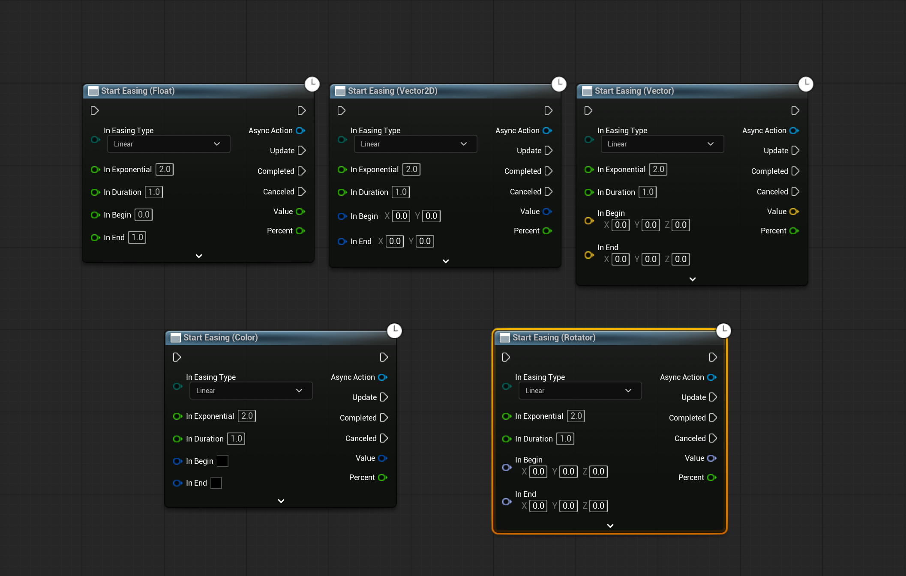
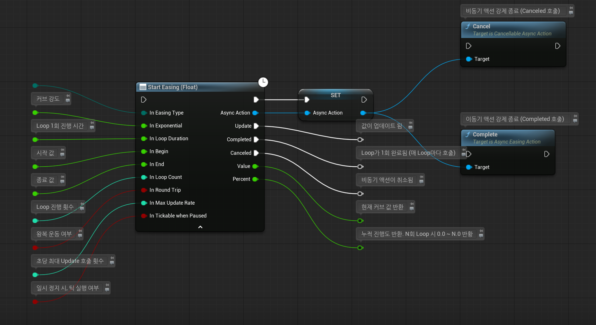
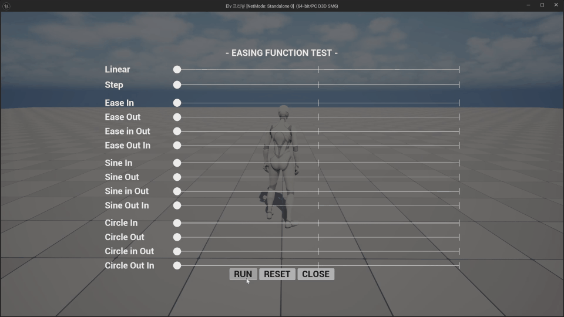

# UE5 Simple Easing Function

> Built as a lightweight Blueprint utility plugin for simple easing and async value interpolation in Unreal Engine 5.

**2026.05.31, v1.1 업데이트**
**버전 표기 규칙을 v1.0.0 형식에서 v1.1 형식으로 변경하였습니다.**

Easing Function과 비동기 액션 노드를 지원하는 Unreal Engine 5 플러그인입니다.

타임라인이나 커브 에셋을 만들 필요 없이, 일정 시간동안 자연스럽게 변화하는 동작을 간편하게 구현할 수 있습니다.

---

---

## Features

- Easing Function Library 제공
- Float / Vector2D / Vector / Rotation / Color 변수 타입 지원
- Async Action 기반의 Async Easing Action 지원

---

## Design Note

Unreal Engine 5에서는 Timeline, Curve 등 다양한 방식으로 값을 보간할 수 있습니다.

하지만 간단한 UI 애니메이션, 라이트 변환, 위치 이동 등의 "짧고 단순한 동작"마다,
Curve 에셋을 추가하거나 Timeline을 구성하는 것은 귀찮고 번거롭습니다.

이런 번거로움을 해결하고자 만든 것이 바로, Async Easing Action 입니다.

단 하나의 블루프린트 노드를 사용해, 단순한 움직임을 쉽고 간단하게 구현할 수 있습니다.

---

## Node Pins

기본 입력은 다음과 같습니다.

| In Pin | Description |
| --- | --- |
| Easing Type | 사용할 Easing Function을 선택합니다. |
| Exponential | Easing Function 계산에 사용되는 지수 값입니다. |
| LoopDuration | 루프 1회에 걸리는 시간입니다. (v1.1) |
| Begin | 시작 값입니다. |
| End | 종료 값입니다. |
| LoopCount | 루프 횟수를 지정합니다. (v1.1) |
| RoundTrip | 액션을 왕복 운동으로 전환합니다. (v1.1) |
| MaxUpdateRate | 초당 Update 최대 호출 횟수입니다. (v1.1) |
| Tickable When Paused | 게임이 일시정지되었을 때 실행 여부입니다. |

| Out Pin | Description |
| --- | --- |
| Update | 설정된 Update Rate에 따라 현재 보간 값과 진행률을 반환하는 이벤트 입니다. |
| Completed | 보간이 정상적으로 끝났을 때 호출되는 이벤트 입니다. |
| Canceled | 사용자가 액션을 취소했을 때 호출되는 이벤트 입니다. |
| Value | 반환된 보간 값입니다. |
| Percent | 비동기 액션의 누적 진행도 입니다. N회 루프 시 0.0 ~ N.0을 반환합니다. (v1.1) |

---

## Supported Easing Functions

이 플러그인에서 제공하는 Easing Function은 다음과 같습니다.

- Linear
- Step
- Ease (In/Out/InOut/OutIn)
- Sine (In/Out/InOut/OutIn)
- Circle (In/Out/InOut/OutIn)
- Back (In/Out/InOut/OutIn)
- Bounce (In/Out/InOut/OutIn)

---

## Installation

1. 이 저장소의 최신 릴리즈에서 'Source code (zip)'을 다운로드 합니다.
   - 2026.05.31 기준 v1.1
2. 프로젝트의 `Plugins` 폴더에 플러그인 폴더를 복사합니다.
3. Unreal Editor를 실행합니다.
4. Plugins 창에서 `Simple Easing Function` 플러그인을 활성화합니다.
5. 프로젝트를 재시작합니다.

---

## Usage

Blueprint에서 다음 노드를 검색해 사용할 수 있습니다.

- `Easing Function`
- `Start Easing (Float)`
- `Start Easing (Vector2D)`
- `Start Easing (Vector)`
- `Start Easing (Color)`
- `Start Easing (Rotator)`

---

## Current Status

- Portfolio project
- Runtime plugin
- Developed with Unreal Engine 5.7
- No content assets required

---

## License

This project is licensed under the MIT License.
